# Guía de Workflow: Git y Despliegue

De ahora en adelante, trabajaremos con dos ramas principales:

1.  **`develop`**: Donde hacemos los cambios y probamos todo en local.
2.  **`master`**: El código "sagrado" que está funcionando en el servidor (Producción).

---

## 🚀 1. Guardar cambios en `develop` (Tu PC)

Cada vez que termines una tarea en local:

```bash
# Ver qué archivos cambiaron
git status

# Agregar todos los cambios
git add .

# Guardar con un mensaje descriptivo
git commit -m "feat: configuracion de entornos y electrocardiograma animado"

# Subir a GitHub (rama develop)
git push origin develop
```

---

## 🚢 2. Pasar cambios a `master` (Para Producción)

Cuando ya probaste todo en `develop` y querés que esos cambios suban al sitio real:

```bash
# 1. Cambiar a la rama master
git checkout master

# 2. Traer los cambios de develop a master
git merge develop

# 3. Subir master a GitHub
git push origin master
```

---

## 🔙 3. Volver a trabajar

Después de actualizar master, **siempre** volvé a `develop` para seguir programando:

```bash
git checkout develop
```

---

## 📈 Resumen del Flujo Profesional

```mermaid
graph LR
    A[Programar en local] --> B(Commit en branch 'develop')
    B --> C{¿Listo para Prod?}
    C -- No --> A
    C -- Sí --> D(Merge a branch 'master')
    D --> E(Push a GitHub)
    E --> F[Deploy en VPS]
```



---

> [!IMPORTANT] > **Nunca** trabajes directamente sobre `master`. Si algo se rompe en `develop`, no pasa nada. Si algo se rompe en `master`, el sitio de la Dra. se cae.

---

### ¿Querés que hagamos el primer commit y subida a GitHub ahora mismo?

Si me decís que sí, yo ejecuto los comandos por vos.
